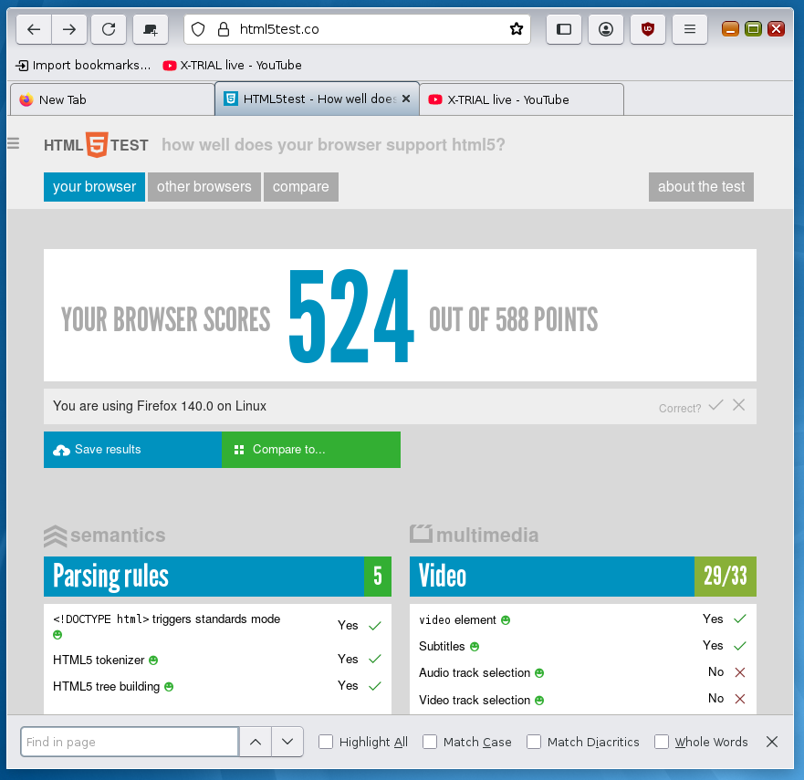

## Description

This theme makes Firefox look more like epiphany/GNOME Web when
running under the [slim-nimbus](https://github.com/RocketMan/solaris-ports/tree/master/components/look-and-feel/slim-nimbus) theme that can be found in
the solaris-ports repo.  The theme is based on Rafael Mardojai's Firefox
Adwaita theme.  See the upstream branch or the upstream repo for information
on the original code.

It has been tested on Firefox 68 esr and Firefox 78 esr under Solaris 11.3.

## Screenshot


### Manual installation
1. Go to `about:support` in Firefox.

2. Application Basics > Profile Directory > Open Directory.

3. Open directory in a terminal.

4. Create a `chrome` directory if it doesn't exist.

	```sh
	mkdir -p chrome
	cd chrome
	```

5. Clone this repo to a subdirectory:

	```sh
	git clone https://github.com/RocketMan/firefox-nimbus-theme.git
	```

    Note: For Firefox 68.x esr ONLY, checkout the tag `firefox-nimbus-theme-v1.0`:

	```sh
	cd firefox-nimbus-theme
	git checkout firefox-nimbus-theme-v1.0
	cd ..
	```

6. Create single-line user CSS files if non-existent or empty (at least one line is needed for `sed`):

	```sh
	[[ -s userChrome.css ]] || echo >> userChrome.css
	```

7. Import this theme at the beginning of the CSS files (all `@import`s must come before any existing `@namespace` declarations):

	```sh
	sed -i '1s/^/@import "firefox-nimbus-theme\/userChrome.css";\n/' userChrome.css
	```

8. Symlink preferences file:

	```sh
	ln -s chrome/firefox-nimbus-theme/configuration/user.js ../user.js
	```

9. Restart Firefox.

10. Open Firefox customization panel and move the new tab button to headerbar.

11. Enjoy Firefox in the style of the nimbus gtk3 theme.

### Updating

1. Go to `about:support` in Firefox.

2. Application Basics > Profile Directory > Open Directory.

3. Open directory in a terminal.

4. In the terminal window, execute:

	```sh
	cd chrome/firefox-nimbus-theme
	git pull --rebase origin master
	```
